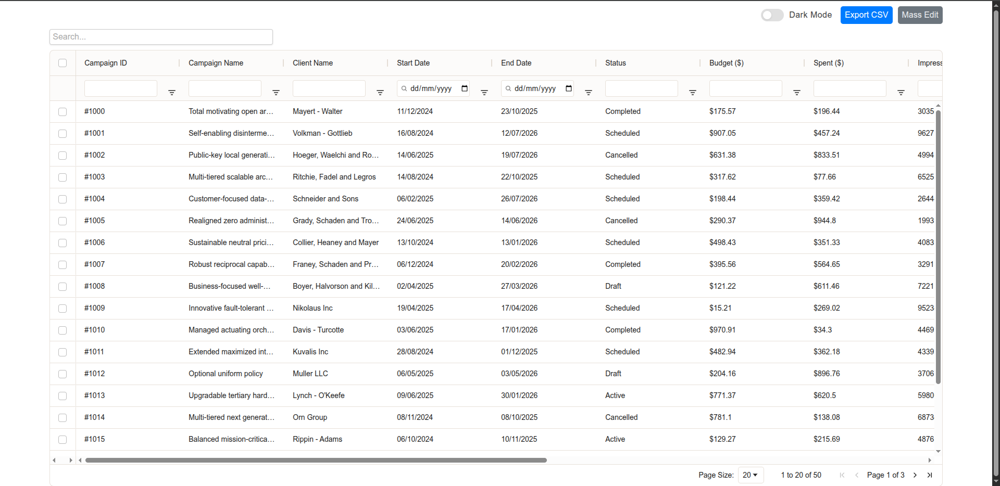
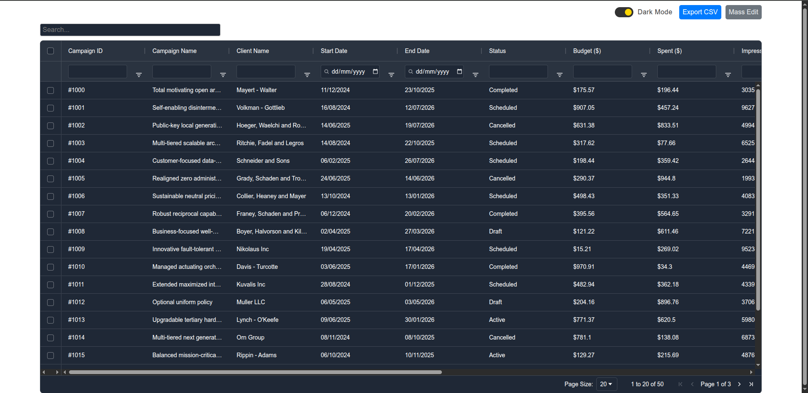

# Campaign Assignment Project

## Live Demo
Check out the live version of the project here: [Campaign Assignment Live Demo](https://akhanda4.github.io/campaign-assignment/)

This project demonstrates the use of **AG Grid** to create an interactive and feature-rich data table. Below is a detailed overview of the features implemented in this project.

## Features

### 1. Sorting
- Users can sort columns in ascending or descending order by clicking on the column headers.
- Multi-column sorting is supported by holding down the `Shift` key while selecting multiple columns.

### 2. Filtering
- Column-specific filtering allows users to narrow down data based on their requirements.
- Multiple filter types are supported, such as text, number, and date filters.

### 3. Quick Search
- A global search bar is provided to quickly search through all rows and columns in the grid.

### 4. Dark Mode
- The grid supports a **Dark Mode** theme for better usability in low-light environments.
- Users can toggle between light and dark modes dynamically.

### 5. Mass Edit
- Users can select multiple rows and edit them simultaneously.
- This feature is useful for bulk updates to the data.

### 6. Mass Edit Validations
- Validation rules are applied during mass edits to ensure data integrity.
- Invalid entries are highlighted, and users are prompted to correct them.

### 7. Pagination
- Data is paginated for better performance and usability.
- Users can navigate between pages using the pagination controls.

### 8. Column Move
- Columns can be rearranged by dragging and dropping them to the desired position.
- The new column order is dynamically applied to the grid.

### 9. Export to CSV
- Users can export the grid data to a CSV file with a single click.
- The exported file retains the current sorting, filtering, and column order.

### 10. Interactive UI
- The grid is designed with an intuitive and interactive user interface.
- Features like hover effects, tooltips, and responsive design enhance the user experience.

## Technologies Used
- **AG Grid**: For implementing the grid and its features.
- **JavaScript/TypeScript**: For handling grid logic and interactivity.
- **CSS**: For styling the grid and implementing dark mode.

## How to Run the Project
1. Clone the repository:
   ```bash
   git clone https://github.com/akhanda4/campaign-assignment.git
   ```
2. Navigate to the project directory:
   ```bash
   cd campaign-assignment
   ```
3. Install dependencies:
   ```bash
   npm install
   ```
4. Start the development server:
   ```bash
   npm start
   ```
5. Open your browser and navigate to `http://localhost:3000` || `8080`.

## Screenshots
### Light Mode


### Dark Mode


## Future Enhancements
- Add support for server-side pagination and filtering.
- Implement real-time data updates using WebSockets.
- Add more export options (e.g., Excel, PDF).

## License
This project is licensed under the MIT License. See the [LICENSE](./LICENSE) file for details.

---
Feel free to contribute to this project by submitting issues or pull